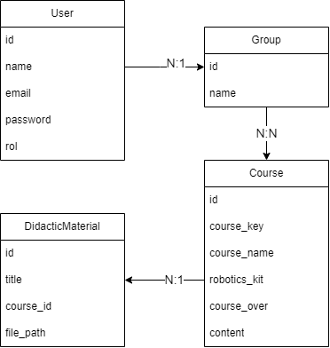

## Información Personal

**Nombre:** Daniel Samael Gámez Garza  
**Matrícula:** AL02976026  
**Carrera:** Ingenieria de Desarrollo de Software  
**Semestre:** Octavo Semestre 

## Información de la Asignatura

**Nombre de la asignatura:** Diseño de Aplicaciones Web  
**Profesor:** Jesús Garza Guerrero  

##  Opciones de etiquetado formato Markdown:

- **Encabezados:** Se crean usando el símbolo `#`. Ejemplo: `# Encabezado 1`, `## Encabezado 2`.
- **Negritas:** Se usan dos asteriscos `**` o guiones bajos `__`. Ejemplo: `**texto en negrita**`.
- **Cursivas:** Se usa un asterisco `*` o guión bajo `_`. Ejemplo: `*texto en cursiva*`.
- **Listas:** Las listas ordenadas usan números, y las listas no ordenadas usan guiones `-` o asteriscos `*`.
- **Citas:** Se crean usando el símbolo `>`. Ejemplo: `> Esto es una cita`.
- **Enlaces:** Se crean usando `[texto](URL)`. Ejemplo: `[GitHub](https://github.com)`.
- **Imágenes:** Se insertan con ``. Ejemplo: ``.

## Comandos de Git

A continuación se listan algunos comandos útiles de Git:

1. **Revisar el estado de un repositorio local:**
   ```bash
   git status

2. **Añadir Archivos Individuales:**
    ```bash
     git add <archivo>

3. **Añadir Todos los Archivos:**
    ```bash
     git add .

4. **Agregar comentarios al commit:**
    ```bash
    git commit -m "Mensaje del commit"

5. **Subir cambios al repositorio remoto:**
    ```bash
    git push origin <rama>

6. **Crear Nueva Rama:**
    ```bash 
    git branch <nombre-de-la-rama>

7. **Cambiar de rama:**
    ```bash 
    git checkout <nombre-de-la-rama>

8. **Eliminar una rama:**
    ```bash
    git branch -d <nombre-de-la-rama>

9. **Hacer rollback a un commit específico:**
    ```bash
    git reset --hard <ID-del-commit>

# Actividad 6: Gestión de Productos en Laravel

Se creo una carpeta llamada products dentro de resoures/views
creando 3 archivos tipo php con estos mismos formatos:

1. **view.blade.php:**
   ```bash
    <!DOCTYPE html>
    <html>
    <head>
        <title>Product View</title>
    </head>
    <body>
        <!--CONTENIDO-->
    </body>
    </html>

2. **edit.blade.php:**
   ```bash
    <!DOCTYPE html>
    <html>
    <head>
        <title>Product Editing</title>
    </head>
    <body>
        <!--CONTENIDO-->
    </body>
    </html>

3. **create.blade.php:**
   ```bash
    <!DOCTYPE html>
    <html>
    <head>
        <title>New Product Creation</title>
    </head>
    <body>
        <!--CONTENIDO-->
    </body>
    </html>

# Proyecto Activity 7

## Nombre del Proyecto
Sistema de Gestión para Escuela de Robótica

## Descripción del Proyecto
Este proyecto es un sistema de gestión para una pequeña escuela de robótica que permite a los profesores gestionar cursos, a los estudiantes inscribirse en grupos, y a los administradores supervisar la plataforma.

## Diagrama ER


El esquema de la base de datos incluye entidades como usuarios, grupos, cursos y materiales didácticos. También soporta múltiples roles: estudiantes, profesores y administradores.

## Instalación
1. Clona el repositorio.
2. Ejecuta `composer install`.
3. Configura tu archivo `.env`.
4. Ejecuta las migraciones: `php artisan migrate`.
5. Población de la base de datos: `php artisan db:seed`.
6. Inicia el servidor: `php artisan serve`.

## Usuarios registrados de prueba
- **Administrador:**
  - Usuario: Admon
  - Correo: admon@robotics.com
  - Contraseña: Adm@2022
- **Profesor:**
  - Usuario: Tecmilenio
  - Correo: tecmilenio@robotics.com
  - Contraseña: Adm@2022
- **Estudiante:**
  - Usuario: Student
  - Correo: student@robotics.com
  - Contraseña: Adm@2022

# Activity 9

Este proyecto de Laravel 8 implementa un sistema de autenticación. Los usuarios no registrados ven una página de aterrizaje (landingpage), mientras que los usuarios autenticados acceden a un dashboard.

## Instrucciones

1. Regístrate o inicia sesión para acceder al dashboard.
2. Los usuarios no registrados solo pueden ver la landingpage.
3. La barra de navegación cambia según si el usuario está autenticado o no.

# Evidencia 2 - Sistema de Gestión de Pedidos

Este proyecto es un sistema de gestión de pedidos desarrollado en Laravel 8. Permite realizar operaciones CRUD (Crear, Leer, Actualizar, Eliminar) sobre una entidad llamada **Pedido**. Además, cuenta con validaciones de datos y manejo de imágenes (pendiente de implementación).

## Funcionalidades

- Listar todos los pedidos.
- Ver detalles de un pedido específico.
- Crear un nuevo pedido con campos como cliente, producto, precio y tracking.
- Editar un pedido existente.
- Eliminar un pedido.
- **Próxima funcionalidad**: Añadir y mostrar imágenes para cada pedido.

# Actividad 11: Menus Project

Este proyecto es una aplicación básica en PHP Laravel 8 que muestra un menú de navegación con tres secciones: Home, Photos y Contact. Cada sección tiene una vista única, y la sección activa en el menú se resalta cuando se accede. Además, un footer aparece en todas las vistas con información sobre quién realiza la actividad.

## Estructura del Proyecto

- **Home**: Página principal del proyecto.
- **Photos**: Galería de fotos (ejemplo).
- **Contact**: Página de contacto.
- **Footer**: Información sobre la actividad, mostrada en todas las vistas.

# Task 9 - Laravel 8 with AdminLTE 3 Integration

Este proyecto utiliza Laravel 8 integrado con AdminLTE 3 como plantilla de administración. Es una continuación de la Actividad 11, donde las secciones y funcionalidades se adaptaron al diseño de AdminLTE.

## Características del Proyecto

1. **Integración de AdminLTE 3**: Se utilizó el paquete `jeroennoten/laravel-adminlte` para implementar la plantilla en Laravel 8.
2. **Personalización del menú lateral**: Se configuraron las opciones del menú lateral para incluir las secciones de la Actividad 11.
3. **Vistas personalizadas**: Se asignó contenido específico a cada sección de acuerdo con la Actividad 11.
4. **Footer personalizado**: Se añadió información específica al footer para identificar al autor y la actividad.

# Actividad 12: Chuck Norris Facts - Vue.js App

Este es un proyecto simple que muestra datos curiosos de Chuck Norris utilizando Vue.js. El objetivo es aprender a trabajar con datos dinámicos y estilizar una lista interactiva.

## Descripción

La aplicación utiliza Vue.js para mostrar una lista de frases relacionadas con Chuck Norris, iterando sobre un conjunto de datos proporcionado. La interfaz es sencilla y estilizada, brindando una experiencia de usuario atractiva.

## Características

- Lista dinámica generada con Vue.js y la directiva `v-for`.
- Diseño limpio y responsivo utilizando CSS.
- Estructura de proyecto modular con archivos HTML, JavaScript y CSS separados.